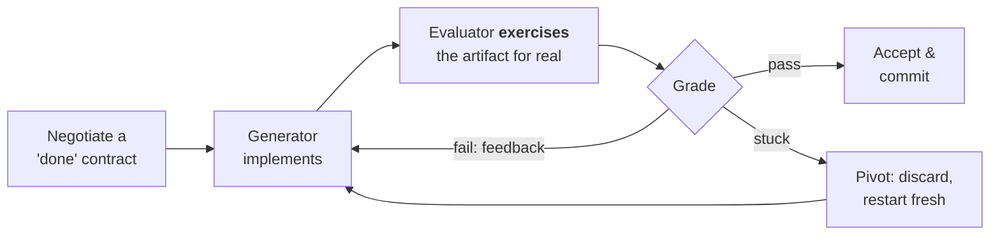
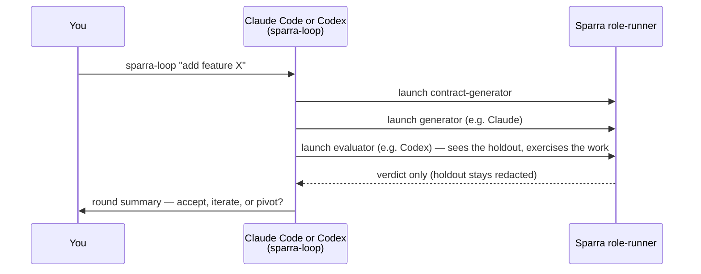
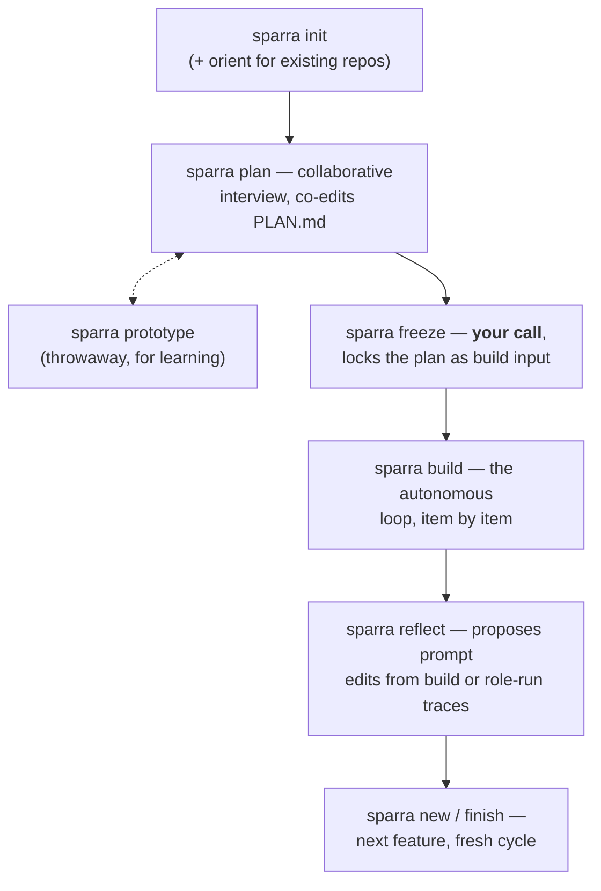

# Sparra

[](https://github.com/KristopherGBaker/Sparra/actions/workflows/ci.yml)

An **adversarial build harness**. Sparra builds software one work item at a time: each item is negotiated into a checkable "done" contract, implemented by a generator, then graded by an adversarial evaluator that **actually runs the artifact** — with **cross-model judging** (Claude builds while Codex judges, or vice versa) and an optional **holdout wall** of evaluator-only checks the builder can't overfit to.



Works on new and existing codebases, over pluggable agent backends (**Claude and Codex** today — the Codex backend also fronts any OpenAI-compatible endpoint). Everything reads and writes the filesystem, so every run is inspectable, diffable, and resumable.

> **Status:** young and still finding its form, but already earning its keep on real projects (and on Sparra itself). Inspired by the Anthropic workshop [Build Agents That Run for Hours](https://youtu.be/mR-WAvEPRwE).

## Quick start: drive it from Claude Code or Codex

The **`sparra-loop`** skill runs the loop above inside either interactive host, with you on the
wheel — steer every step, or let it run in auto mode and step in only when needed. Claude Code and
Codex are equal conductors; the generator and evaluator backends remain independently configurable.

First install Sparra from a clone of this repo. `npm link` is required for both hosts because it
puts the `sparra` and `sparra-run-mcp` package bins on `PATH`:

```bash
npm install && npm link           # puts `sparra` + `sparra-run-mcp` on your PATH
npm i @openai/codex-sdk           # optional: only for a Codex backend (also needs the `codex` CLI authed)
```

### Claude Code

```bash
claude mcp add sparra-run --scope user -- sparra-run-mcp   # the role-runner MCP tool
claude plugin marketplace add "$PWD"
claude plugin install sparra@sparra-skills                 # gives you /sparra-loop and /sparra
```

Open Claude Code **in your project** and type `/sparra-loop`.

### Codex

Open an interactive Codex session in the Sparra clone and ask:

```text
Install the local Sparra plugin from this checkout using .codex-plugin/plugin.json.
```

After installation, start a **fresh Codex thread in your project** so the plugin's skills and MCP
tools load, then ask `Use sparra-loop to add feature X`. Codex primarily launches the installed
`sparra` CLI as background JSON processes, keeping the conductor responsive; direct MCP is an
approval-gated fallback. The packaged MCP declaration uses `sparra-run-mcp` from `PATH` and raises
Codex's 60-second default `tool_timeout_sec` to `1800` for multi-minute role calls. See the
[role-runner guide](docs/role-runner.md#codex-install-and-run) for the exact CLI, resume, manual MCP,
and reinstall paths.

Either host sets the project up (`sparra init`, per-role backend/model split, optional holdout) and
drives the loop:



The holdout is passed **by path** and only the evaluator ever sees it; the runner returns the parsed verdict, never raw output. Details, guarantees, and the CLI equivalents (`sparra role run`, `sparra eval`): **[docs/role-runner.md](docs/role-runner.md)**.

**Just want a second opinion?** `sparra eval <dir> --contract contract.md --backend codex` grades any work-in-progress tree against a contract — no `.sparra/` setup required. Add `--worktree` to evaluate a snapshot without touching your tree.

## Fully autonomous: the CLI phases

Prefer to hand off? The same engine runs unattended as a sequence of phases — collaborative planning, a human freeze gate, then the autonomous build loop:



```bash
cd your-project/     # new or existing; Sparra detects which
sparra plan && sparra freeze && sparra build && sparra reflect
sparra status        # where am I? what's next?
sparra resume        # continue any phase from disk
```

`sparra build --step` pauses at each checkpoint for human steering; `sparra help` lists everything else (`batch`, `finish`, `clean`, `prompts audit`, `measure`, …). → [docs/phases.md](docs/phases.md)

## Key ideas

- **The evaluator runs your code.** Grading is evidence-based: it builds, launches, and exercises the artifact (CLI, web, or iOS Simulator with screenshot **and animation contact-sheet** reading), and won't pass flaky or gamed results. → [docs/build-loop.md](docs/build-loop.md)
- **Cross-model on tap.** Pick the backend per role — one model family builds while another judges, for a genuinely independent second opinion. → [docs/backends.md](docs/backends.md)
- **Holdout wall.** Evaluator-only acceptance checks the builder never sees, so it can't teach to the test. → [docs/role-runner.md](docs/role-runner.md#what-the-runner-enforces-the-holdout-wall)
- **Bounded & safe by default.** Per-item budgets, sandboxed permissions, and a git-worktree boundary — Sparra never commits to your main branch. → [docs/build-loop.md](docs/build-loop.md#sandbox-first-safety)
- **Filesystem is the source of truth.** Contracts, verdicts, traces, and memory all live in `.sparra/` on disk — resumable from any point, and it survives provider rate limits unattended. → [docs/configuration.md](docs/configuration.md)
- **Self-improving.** `sparra reflect` reads build traces, or safe ad-hoc role-run trace bundles, and proposes prompt edits you approve. → [docs/phases.md](docs/phases.md#self-improvement-outer-loop)

## Adapt it to your stack

Sparra is a harness, not a fixed pipeline. The [iOS/macOS support](docs/ios.md) is really *one worked example* of fitting it to a stack — a custom exerciser plus injected house conventions — and the same hooks let you fit it to yours, in any language:

- **Exercise your way** — `exercise.mechanism: custom` runs your own shell recipe to build/run/probe the artifact (`cli` and `web` cover the common cases). → [docs/build-loop.md](docs/build-loop.md#exercisers)
- **Your own verify + QA commands** — `build.verifyCommands` (how the generator checks itself) and `measure.command` (your project's benchmark/QA harness) are just your commands. → [docs/configuration.md](docs/configuration.md)
- **Teach it your tooling** — hand any role a skill (`roles.<role>.skills`, a `SKILL.md` describing your build/test/deploy) and edit the role prompts in `.sparra/prompts` to inject your conventions. → [docs/backends.md](docs/backends.md#skills)

## Docs

| | |
|---|---|
| [Phases](docs/phases.md) | orient → plan ⇄ prototype → freeze → build → reflect; greenfield vs brownfield |
| [The build loop](docs/build-loop.md) | contract negotiation, exercising, pivots, budgets, code review, measure, memory |
| [Role-runner](docs/role-runner.md) | the interactive seam: `/sparra-loop`, MCP `run_role`, `sparra eval`, the holdout wall |
| [Agent backends](docs/backends.md) | Claude + Codex, per-role backends, OpenAI-compatible endpoints, skills |
| [iOS / macOS](docs/ios.md) | Simulator builds, `xcodebuildmcp`, XcodeGen, multimodal UI grading |
| [Configuration](docs/configuration.md) | every knob, the `.sparra/` on-disk layout, resuming |

## Requirements

- **Node 20+** and `npm install`. Interactive-host setup also requires `npm link` so both `sparra`
  and `sparra-run-mcp` are on `PATH`.
- At least one agent backend: an **Anthropic credential** (`ANTHROPIC_API_KEY` or a Claude Code
  login), or `npm i @openai/codex-sdk` plus an authenticated **Codex CLI**. → [docs/backends.md](docs/backends.md)
- Optional **iOS/macOS** exercising: macOS + Xcode + a Simulator + `xcodebuildmcp` + `xcodegen`. → [docs/ios.md](docs/ios.md)

No build step — the bins run the TypeScript directly via `tsx`, so a `git pull` takes effect immediately.

## License

[MIT](LICENSE) © Kristopher Baker
